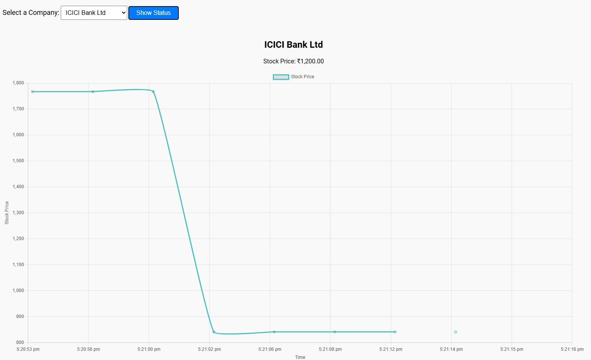
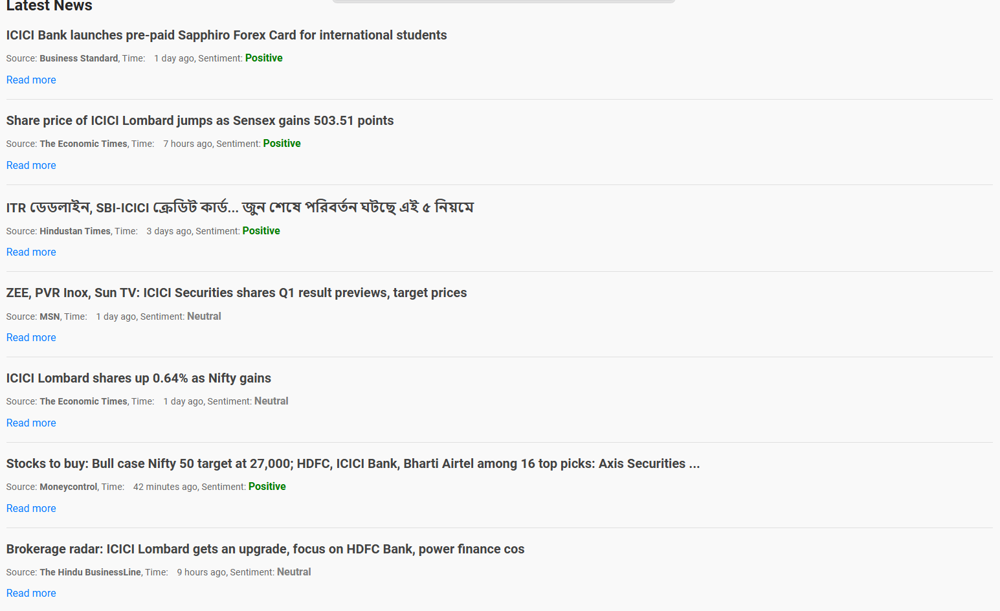
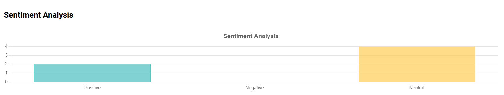

# Sentiment-Driven News Analysis for Investors

This project predicts the sentiment of news headlines ('positive', 'negative', or 'neutral') to help investors make informed decisions. The GUI displays live stock prices, news headlines, and sentiment scores for HDFC, State Bank of India, ICICI, and AXIS Bank.

## Features

- Predicts sentiment of news headlines: positive, negative, or neutral
- Displays live stock prices with a 3-second delay (web scraping)
- Shows news headlines and corresponding sentiment scores
- Provides a summary bar chart of sentiment scores

## Technologies Used

- HTML, CSS, JavaScript (for GUI)
- Python (for sentiment analysis model, web scraping, and Flask server)
- Jupyter Notebook (for creating the model)
- BeautifulSoup (for extracting news headlines and live stock prices)
- Flask (for creating the GUI application)
- Pickle (.pkl) file (for model integration)

## Installation and Setup

1. **Clone the repository:**

   ```bash
   git clone https://github.com/EthoKikon/Stock-Prediction.git
   ```

2. **Navigate to the project directory:**

   ```bash
   cd Stock-Prediction
   ```

3. **Create and activate a virtual environment (optional but recommended):**

   ```bash
   python -m venv venv
   source venv/bin/activate  # On Windows, use `venv\Scripts\activate`
   ```

4. **Install necessary dependencies:**

   ```bash
   pip install -r requirements.txt
   ```

5. **Run the Flask server:**

   ```bash
   python app.py
   ```

6. **Open a web browser and go to:**
   ```
   http://127.0.0.1:5000/
   ```

### Clone the Repository

First, clone the repository to your local machine using the following command:

```bash
git clone https://github.com/EthoKikon/Stock-Prediction.git
cd Stock-Prediction


## Usage

- Open a web browser and go to `http://127.0.0.1:5000/`
- Select a bank (HDFC, State Bank of India, ICICI, AXIS Bank) from the interface.
- View the live stock price, news headlines with sentiment scores, and the summary bar chart.

## Project Structure

- `Gui/app.py`: Contains the Flask server code and routes.
- `Gui/static/`: Contains static files like CSS and JavaScript.
- `Gui/templates/`: Contains HTML templates.
- `Gui/svm_model.pkl`: Contains the pre-trained sentiment analysis model (`svm_model.pkl`).

## Screenshots

### Live Stock Prices



### News Headlines with Sentiment Scores



### Summary Bar Chart of Sentiment Scores


```
